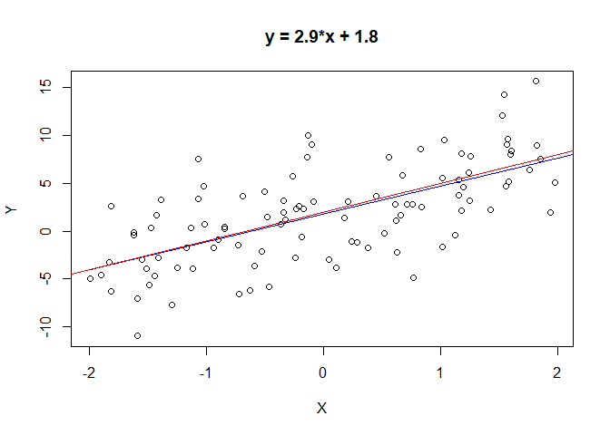
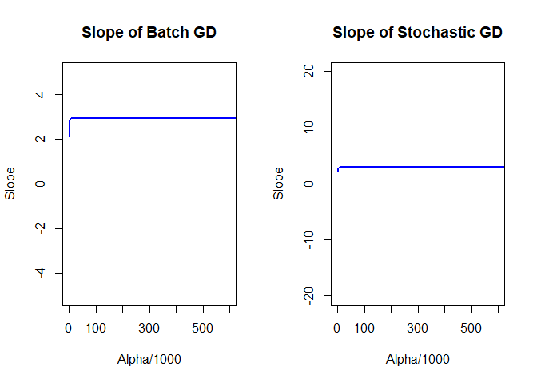
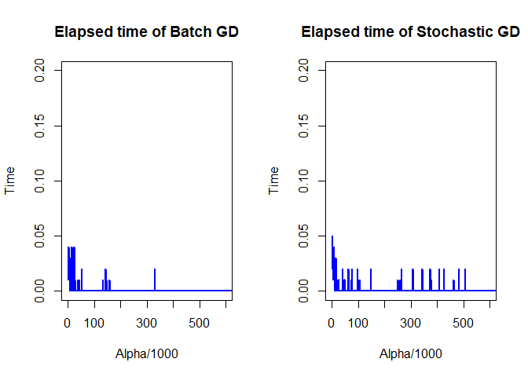
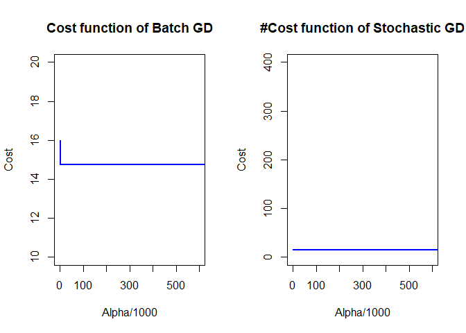
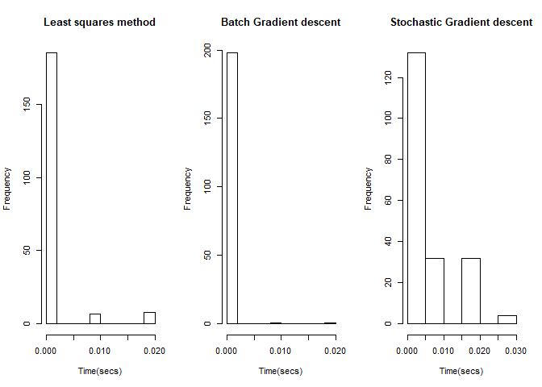
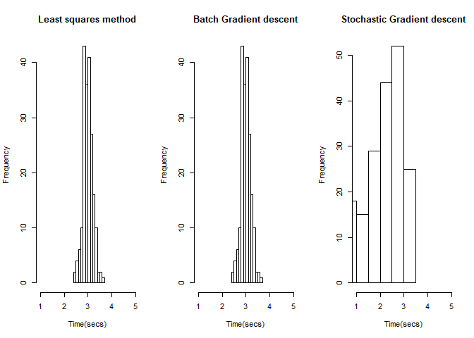

Step 1: Creating the dataset
============================

Simulate N=100 values of *X*<sub>*i*</sub>, distributed Uniformly on interval (-2,2). Simulate the values of *Y*<sub>*i*</sub> = 2+3*X*<sub>*i*</sub> +*ϵ*<sub>*i*</sub>, where *ϵ*<sub>*i*</sub> is drawn from N(0; 4). Estimate the slope of linear regression using least squares. How close is it to the truth?
-------------------------------------------------------------------------------------------------------------------------------------------------------------------------------------------------------------------------------------------------------------------------------------------------------------------

We need to create a simulated dataset.

``` r
set.seed(123)
X <- runif(100, -2, 2)
epsilon <- rnorm(n = 100, mean = 0, sd = 4)

Y <- 2 + 3*X + epsilon

dataset <- data.frame("X" = X, "Y" = Y)

lm.fit <- lm(Y ~ X, data = dataset)
coeff = coefficients(lm.fit)

coeff
```

    ## (Intercept)           X 
    ##    1.784498    2.910169

Above are the slope and intercept. The equation of line is given is -

``` r
# equation of the line : 
eq = paste0("y = ", round(coeff[2],1), "*x + ", round(coeff[1],1))
```

Let us plot a graph of the model.

``` r
# plot
par(mfrow = c(1,1))
plot(dataset, main = eq)
abline(lm.fit, col = "blue")
abline(2, 3, col = "red")
```



The red line represents the true relationship, f(X) = 2 + 3X, which is the population regression line. The blue line is the least squares line based on the observed data.

We can see that the least squares line is quite close to the population regression line

Step 2: Implementing Batch Gradient Descent
===========================================

Implement batch gradient descent and stochastic gradient descent to estimate the slope and the intercept, as function of the learning rate *α*. Stop the iterations when the change in the parameter between two consecutive iterations is less than 0.1, or when the number of iterations exceeds a large number (say, 1000).
------------------------------------------------------------------------------------------------------------------------------------------------------------------------------------------------------------------------------------------------------------------------------------------------------------------------------

We will first implement Batch Gradient Descent.

``` r
batchGD <- function(alpha, X, Y, conv_threshold, max_iterations) {
  
  # Add a column of 1's to the original matrix for the intercept co-efficient
  X1 <- cbind(1, matrix(X))
  
  # Initialize coefficients
  theta <- matrix(c(0, 0), nrow = 2)
  MSE <- 0
  
  # Maintain history of cost functions and co-efficients
  cost_history <- vector()
  theta_history <- list(1000)
  
  iterations <- 1
  converged <-  F
  
  while (converged == F) {
    
    # Calculate Batch Gradient Descent
    error <- (X1 %*% theta) - Y
    delta <- (t(X1) %*% error) / length(Y)
    MSE_new <- sum(((X1 %*% theta) - Y) ^ 2) / (length(Y))
    theta_new <- theta - (alpha * delta)
    
    cost_history[iterations] <- MSE_new
    theta_history[[iterations]] <- theta_new
    
    #if (abs(MSE - MSE_new) < 0.0001)
    #  break
    
    # Convergence test #1
    if ((abs(theta_new[1] - theta[1]) < conv_threshold)
        &&
        (abs(theta_new[2] - theta[2]) < conv_threshold))
    {
      converged = T
      return(list(iterations, cost_history, theta_history, theta_new, MSE_new))
    }
    
    iterations <- iterations + 1
    
    # Convergence test #2
    if (iterations >= max_iterations) {
      converged = T
      return(list(iterations, cost_history, theta_history, theta_new, MSE_new))
    }
    MSE <- MSE_new
    theta <- theta_new
  }
}
```

Let us try running the function for a learning rate of 0.01.

The inputs to the function are -

1.  learning rate

2.  feature matrix X

3.  labels Y

4.  Difference between old and new values for which convergence should occur

5.  Maximum number of iterations

``` r
bgd <- batchGD(0.01, X, Y, 0.0001, 1000)

# Number of iterations
bgd[1][[1]]
```

    ## [1] 520

``` r
# Mean square error
bgd[5][[1]]
```

    ## [1] 14.73187

``` r
# Final parameters
bgd[4][[1]]
```

    ##          [,1]
    ## [1,] 1.774660
    ## [2,] 2.906552

Step 3: Implementing Stochastic Gradient Descent
================================================

Let us now implement Stochastic Gradient Descent.

``` r
stochasticGD <- function(alpha, X, Y, conv_threshold, max_iterations) {
  
    # Add a column of 1's to the original matrix for the intercept co-efficient
    X1 <- cbind(1, matrix(X))
    
    # Initialize coefficients
    theta <- matrix(c(0, 0), nrow = 2)
    
    # Maintain history of cost functions and co-efficients
    cost_history <- vector()
    theta_history <- list(1000)
    
    # Initial conditions
    MSE <- 0
    iterations <- 1
    converged <-  F
    
    j <- 0
    
    while (converged == F) {
      
      rand <- sample(nrow(X1))
      
      # Calculate Stochastic Gradient Descent
      for (i in 1:length(Y))
      {
        error <- sum((X1[rand[i], ] %*% theta) - Y[rand[i]])
        delta <- (matrix(X1[rand[i], ]) * error)
        MSE_new <- sum(((X1 %*% theta) - Y) ^ 2) / (length(Y))
        theta_new <- theta - (alpha * delta)
        
        cost_history[i + (j * 100)] <- MSE_new
        theta_history[[i + (j * 100)]] <- theta_new
        
        # Convergence test #1
        if ((abs(theta_new[1] - theta[1]) < conv_threshold)
            &&
            (abs(theta_new[2] - theta[2]) < conv_threshold))
          {
          converged = T
          #print("here")
          return(list(iterations, cost_history, theta_history, theta_new, MSE_new))
        }
        
        MSE <- MSE_new
        theta <- theta_new
        iterations <- iterations + 1
        
        # Convergence test #2
        if (iterations >= max_iterations)
        {
          convergence = T
          return(list(iterations, cost_history, theta_history, theta_new, MSE_new))
        }
      }
      j <- j + 1
    }
  }
```

Let us try running Stochastic Gradient Descent for alpha = 0.01. The input parameters to the function as same as for Batch Gradient Descent

``` r
sgd <- stochasticGD(0.01, X, Y, 0.0001, 1000)

# Number of iterations
sgd[1][[1]]
```

    ## [1] 597

``` r
# Mean square error
sgd[5][[1]]
```

    ## [1] 14.73589

``` r
# Final parameters
sgd[4][[1]]
```

    ##          [,1]
    ## [1,] 1.724238
    ## [2,] 2.929881

Step 4: Find the best learning rate
===================================

Consider a range of parameter *α*. Estimate the parameters of the regression using batch gradient descent, and using stochastic gradient descent. Plot the estimates of the slope as function of *α*. Plot the time until convergence as function of *α*. Interpret the result, and suggest the best *α*. \[Note: try a few ranges of *α* to get meaningful results\]
---------------------------------------------------------------------------------------------------------------------------------------------------------------------------------------------------------------------------------------------------------------------------------------------------------------------------------------------------------------------

To find the best *α*, we will run batch and stochastic gradient descents for a range of *α* values. We will store their results in separate vectors.

The *α* values will range from 0.001 to 1

``` r
bgd_iterations <- double(1000)
bgd_cost <- double(1000)
bgd_slope <- double(1000)
bgd_time <- double(1000)
sgd_iterations <- double(1000)
sgd_cost <- double(1000)
sgd_slope <- double(1000)
sgd_time <- double(1000)
bgd_mse <- double(1000)
sgd_mse <- double(1000)

for (alpha in 1:1000){
  bgd_time[alpha] <- as.numeric(system.time(bgd <- batchGD(alpha/1000, X, Y, 0.0001, 1000))[3])
  bgd_iterations[alpha] <- as.integer(bgd[1])
  bgd_cost[alpha] <- as.numeric(bgd[5])
  bgd_slope[alpha] <- as.numeric(bgd[4][[1]][2])
  bgd[alpha] <- as.numeric(bgd[5])
  
  sgd_time[alpha] <- as.numeric(system.time(sgd <- batchGD(alpha/1000, X, Y, 0.0001, 1000))[3])
  sgd_iterations[alpha] <- as.integer(sgd[1])
  sgd_cost[alpha] <- as.numeric(sgd[5])
  sgd_slope[alpha] <- as.numeric(sgd[4][[1]][2])
  sgd[alpha] <- as.numeric(sgd[5])
}
```

Plot of estimates of slope for a range of *α* values

``` r
par(mfrow=c(1,2))

# Slope of Batch GD
plot(
  bgd_slope,
  type = 'line',
  col = 'blue',
  lwd = 2,
  main = 'Slope of Batch GD',
  ylab = 'Slope',
  xlab = 'Alpha/1000',
  xlim = c(0, 600),
  ylim = c(-5, 5)
)
```

    ## Warning in plot.xy(xy, type, ...): plot type 'line' will be truncated to
    ## first character

``` r
# Slope of Stochastic GD
plot(
  sgd_slope,
  type = 'line',
  col = 'blue',
  lwd = 2,
  main = 'Slope of Stochastic GD',
  ylab = 'Slope',
  xlab = 'Alpha/1000',
  xlim = c(0, 600),
  ylim = c(-20, 20)
)
```

    ## Warning in plot.xy(xy, type, ...): plot type 'line' will be truncated to
    ## first character



Plot of time until convergence for a range of *α* values

``` r
par(mfrow=c(1,2))

# Elapsed time of Batch GD
plot(
  bgd_time,
  type = 'line',
  col = 'blue',
  lwd = 2,
  main = 'Elapsed time of Batch GD',
  ylab = 'Time',
  xlab = 'Alpha/1000',
  xlim = c(0, 600),
  ylim = c(0, .2)
)
```

    ## Warning in plot.xy(xy, type, ...): plot type 'line' will be truncated to
    ## first character

``` r
# Elapsed time of Stochastic GD
plot(
  sgd_time,
  type = 'line',
  col = 'blue',
  lwd = 2,
  main = 'Elapsed time of Stochastic GD',
  ylab = 'Time',
  xlab = 'Alpha/1000',
  xlim = c(0, 600),
  ylim = c(0, .2)
)
```

    ## Warning in plot.xy(xy, type, ...): plot type 'line' will be truncated to
    ## first character



Plot of number of iterations for range of alpha values

``` r
par(mfrow=c(1,2))

# Number of iterations of Batch GD
plot(
  bgd_iterations,
  type = 'line',
  col = 'blue',
  lwd = 2,
  main = '#Iterations of Batch GD',
  ylab = 'Iterations',
  xlab = 'Alpha/1000',
  xlim = c(0, 1000),
  ylim = c(0, 30)
)
```

    ## Warning in plot.xy(xy, type, ...): plot type 'line' will be truncated to
    ## first character

``` r
# Number of iterations of Stochastic GD
plot(
  sgd_iterations,
  type = 'line',
  col = 'blue',
  lwd = 2,
  main = '#Iterations of Stochastic GD',
  ylab = 'Iterations',
  xlab = 'Alpha/1000',
  xlim = c(0, 600),
  ylim = c(0, 1000)
)
```

    ## Warning in plot.xy(xy, type, ...): plot type 'line' will be truncated to
    ## first character


Let us also have a look at the cost factor for a range of alpha values

``` r
par(mfrow=c(1,2))

# Slope of Batch GD
plot(
  bgd_cost,
  type = 'line',
  col = 'blue',
  lwd = 2,
  main = 'Cost function of Batch GD',
  ylab = 'Cost',
  xlab = 'Alpha/1000',
  xlim = c(0, 600),
  ylim = c(10, 20)
)
```

    ## Warning in plot.xy(xy, type, ...): plot type 'line' will be truncated to
    ## first character

``` r
# Slope of Stochastic GD
plot(
  sgd_cost,
  type = 'line',
  col = 'blue',
  lwd = 2,
  main = '#Cost function of Stochastic GD',
  ylab = 'Cost',
  xlab = 'Alpha/1000',
  xlim = c(0, 600),
  ylim = c(0, 400)
)
```

    ## Warning in plot.xy(xy, type, ...): plot type 'line' will be truncated to
    ## first character



Based on these, I decided to have the following learning rates for batch and stochastic gradient descent.

Batch GD - 0.850 Stochastic GD - 0.005

Step 5: Compare performance on different datasets
=================================================

Repeat Step 1 200 times. Each time, record the slope of the regression estimated by least squares, by batch gradient descent with best *α* from Step 3, and by stochastic gradient descent from best *α* from Step 4. Plot three histograms of these estimates, and overlay the true value. Plot the histograms of time until convergence. Comment on the results.
------------------------------------------------------------------------------------------------------------------------------------------------------------------------------------------------------------------------------------------------------------------------------------------------------------------------------------------------------------------

Creating a function to run the dataset 200 times and calculate regression by all three types.

``` r
f.2d <- function(N, bgd_alpha, sgd_alpha) {
  X <- runif(N,-2, 2)
  epsilon <- rnorm(n = N, mean = 0, sd = 4)
  
  Y <- 2 + 3 * X + epsilon
  #Y
  
  dataset <- data.frame("X" = X, "Y" = Y)
  
  lm.time <-
    as.numeric(system.time(lm.fit <- lm(Y ~ X, data = dataset))[3])
  bgd.time <-
    as.numeric(system.time(bgd <-
                             batchGD(bgd_alpha, X, Y, 0.0001, 1000))[3])
  sgd.time <-
    as.numeric(system.time(sgd <-
                             stochasticGD(sgd_alpha, X, Y, 0.0001, 1000))[3])
  
  lm.coeff <-  coefficients(lm.fit)
  bgd.coeff <- bgd[4][[1]]
  sgd.coeff <- sgd[4][[1]]
  
  return(list(lm.time, bgd.time, sgd.time, lm.coeff, bgd.coeff, sgd.coeff))
}
```

Run the function.

``` r
bgd_alpha <- 0.850
sgd_alpha <- 0.005

lm.slope.200 <- double(200)
bgd.slope.200 <- double(200)
sgd.slope.200 <- double(200)
lm.time.200 <- double(200)
bgd.time.200 <- double(200)
sgd.time.200 <- double(200)

for (i in 1:200){
  output <- f.2d(100, bgd_alpha, sgd_alpha)
  
  lm.time.200[i] <- output[1][[1]]
  bgd.time.200[i] <- output[2][[1]]
  sgd.time.200[i] <- output[3][[1]]
  lm.slope.200[i] <- output[4][[1]][2]
  bgd.slope.200[i] <- output[5][[1]][2]
  sgd.slope.200[i] <- output[6][[1]][2]
}
```

Plot histogram of time for all three models

``` r
par(mfrow=c(1,3))
hist(lm.time.200, main = "Least squares method", xlab = 'Time(secs)')
hist(bgd.time.200, main = "Batch Gradient descent", xlab = 'Time(secs)')
hist(sgd.time.200, main = "Stochastic Gradient descent", xlab = 'Time(secs)')
```



Plot histogram of slope for all three models

``` r
par(mfrow=c(1,3))
hist(lm.slope.200, main = "Least squares method", xlab = 'Time(secs)', xlim = c(1,5))
hist(bgd.slope.200, main = "Batch Gradient descent", xlab = 'Time(secs)', xlim = c(1,5))
hist(sgd.slope.200, main = "Stochastic Gradient descent", xlab = 'Time(secs)', xlim = c(1,5))
```


We can see that the slope follows a normal distribution for all three methods. Thus our estimate of alpha is quite accurate.

Step 6: Repeat previous step with more number of observations
=============================================================

Repeat Step 5, while changing the number of observations N to 300.
------------------------------------------------------------------

Run again for N = 300

``` r
lm.slope.200.2 <- double(200)
bgd.slope.200.2 <- double(200)
sgd.slope.200.2 <- double(200)
lm.time.200.2 <- double(200)
bgd.time.200.2 <- double(200)
sgd.time.200.2 <- double(200)

for (i in 1:200){
  output <- f.2d(300, bgd_alpha, sgd_alpha)
  
  lm.time.200.2[i] <- output[1][[1]]
  bgd.time.200.2[i] <- output[2][[1]]
  sgd.time.200.2[i] <- output[3][[1]]
  lm.slope.200.2[i] <- output[4][[1]][2]
  bgd.slope.200.2[i] <- output[5][[1]][2]
  sgd.slope.200.2[i] <- output[6][[1]][2]
}
```

Plot histogram of time for all three models

``` r
par(mfrow=c(1,3))
hist(lm.time.200.2, main = "Least squares method", xlab = 'Time(secs)')
hist(bgd.time.200.2, main = "Batch Gradient descent", xlab = 'Time(secs)')
hist(sgd.time.200.2, main = "Stochastic Gradient descent", xlab = 'Time(secs)')
```


Plot histogram of slope for all three models

``` r
par(mfrow=c(1,3))
hist(lm.slope.200.2, main = "Least squares method", xlab = 'Time(secs)', xlim = c(1,5))
hist(bgd.slope.200.2, main = "Batch Gradient descent", xlab = 'Time(secs)', xlim = c(1,5))
hist(sgd.slope.200.2, main = "Stochastic Gradient descent", xlab = 'Time(secs)', xlim = c(1,5))
```


